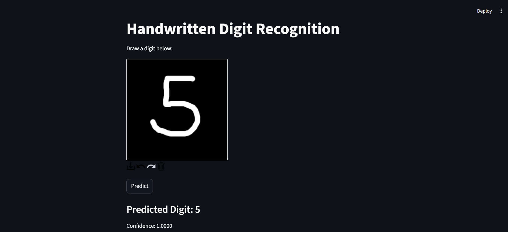

# Handwritten Digit Recognition System

A Deep Learning project using CNN and Streamlit to recognize handwritten digits.

## Features
- CNN-based digit recognition
- Real-time drawing canvas
- Streamlit GUI
- MNIST dataset

## Technologies Used
- Python
- TensorFlow/Keras
- OpenCV
- Streamlit

## Accuracy
98.9% test accuracy on MNIST dataset.

## Run Project

## Application Screenshot



```bash
pip install -r requirements.txt
streamlit run app1.py
```
